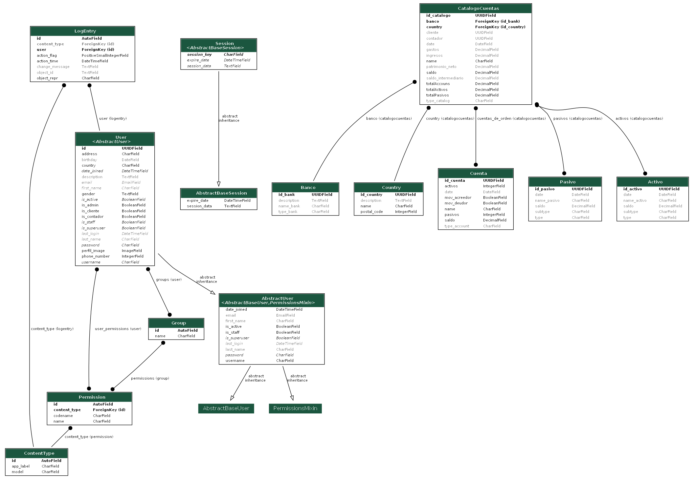
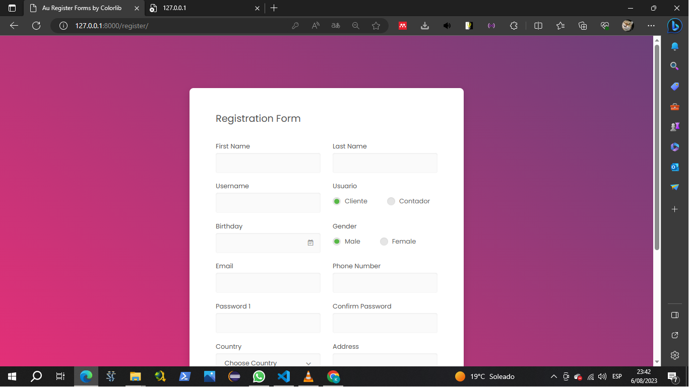
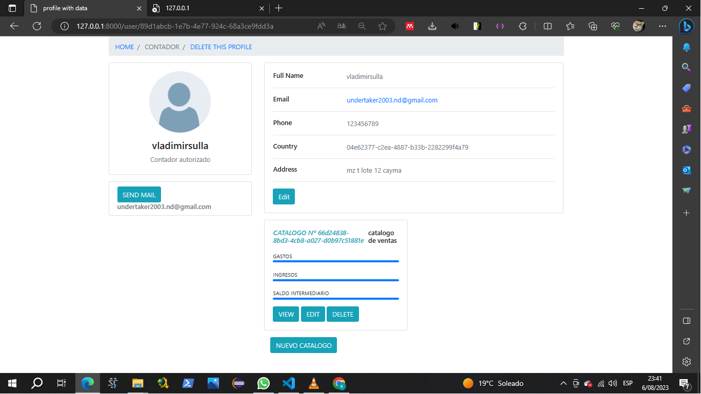
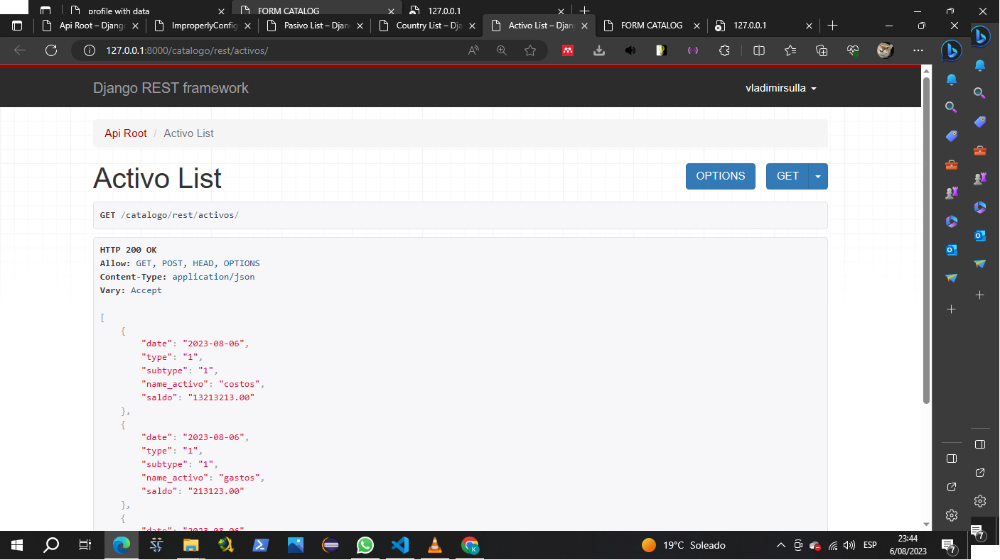
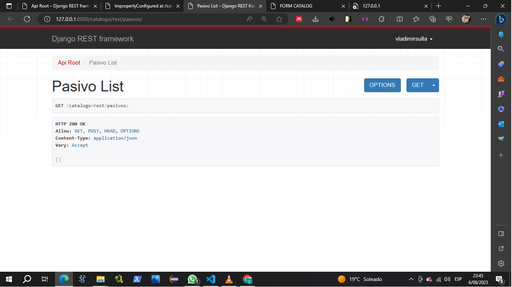

<table>
    <theader>
        <tr>
            <td style="width:25%;"></td>
            <td>
                UNIVERSIDAD NACIONAL DE SAN AGUSTIN 
                FACULTAD DE INGENIERÍA DE PRODUCCIÓN Y SERVICIOS 
                DEPARTAMENTO ACADÉMICO DE INGENIERÍA DE SISTEMAS E INFORMÁTICA 
                ESCUELA PROFESIONAL DE INGENIERÍA DE SISTEMAS
            </td>            
        </tr>
    </theader>
    <tbody>
        <tr>
        <td colspan="2">Proyecto web: Desarrollo de una aplicación web para inscripción de laboratorios</td>
        </tr>
        <tr>
        <td colspan="2">Fecha:  2022/08/09</td>
        </tr>
    </tbody>
</table>

PROYECTO WEB 

<table>
<theader>
<tr><th>INFORMACIÓN BÁSICA</th></tr>
</theader>
<tbody>
    <tr>
        <td>ASIGNATURA:</td><td>Programación Web 2</td>
    </tr>
    <tr>
        <td>SEMESTRE:</td><td>III</td>
    </tr>
    <tr>
        <td>FECHA INICIO:</td><td>30-May-2022</td><td>FECHA FIN:</td>
        <td>03-Jun-2022</td><td>DURACIÓN:</td><td>04 horas</td>
    </tr>
    <tr>
        <td colspan="3">DOCENTES:
        <ul>
        <li>Richart Smith Escobedo Quispe - rescobedoq@unsa.edu.pe</li>
        </ul>
        INTEGRANTES(Grupo A Laboratorio)
        <ul>
            <li>Sulla Quispe Vladimir Arturo(Grupo C - Teoria)</li>
            <li>Martell Villanueva Gabriela Vanessa(Grupo C - Teoria)</li>
            <li>Chaisa Fernandez Anthony(Grupo B - Teoria)</li>
        </ul>
        </td>
    </<tr>
</tdbody>
</table>

#   WebApp con Django

[![License][license]][license-file]
[![Downloads][downloads]][releases]
[![Last Commit][last-commit]][releases]

[![Debian][Debian]][debian-site]
[![Git][Git]][git-site]
[![GitHub][GitHub]][github-site]
[![Vim][Vim]][vim-site]
[![Java][Java]][java-site]

##  Tipo de Sistema
    El sistema consiste en conectar Contador con sus respectivos clientes. El contador elabora catalogos de cuentas que sirven para analisis financieros. Los clientes pueden ver los catalogos y ver como estan sus estados financieros en todo momento.

##  Requisitos del sistema
    El sistema debe satisfacer los siguientes requisitos funcionales y no funcionales:

    - RQ01 : El sistema debe estar disponible en Internet a traves de una URL.
    - RQ02 : El sistema debe permitir el inicio/cierre de sesión.
    - RQ03 : El sistem debe permitir a los contadores hacer las labores de CRUD
    - RQ04 : El sistema debe evitar que los clientes puedan eliminar los catalogos y su edicion sin la autorizacion de un contador   
    - RQ05 : El sistema debe permitir el envio de mensajes mediante su correo electronico  
    - RQ06 : Los catalogos pueden verse y descargarse en formato pdf 
    -   ...

##  Modelo de datos
    El modelo de datos esta conformado por las siguientes entidades.

    -   Usuario : La entidad principal que se ramifica en dos entidades
        - Cliente : El cliente puede logearse y ver catalogos
        - Contador : El contador se encarga de la elaboracion de catalogos y su manipulacion ya que tiene la autorizacion legal para hacerlo

##  Diccionario de datos

    En la construcción de software y en el diccionario de datos sobre todo se recomienda y se utilizará el idioma inglés para especificar objetos, atributos, etc.

| User | | | | | |
| -- | -- | -- | -- | -- | -- |
| Atributo  | Tipo  | Nulo | Clave | Predeterminado | Descripción |
| -- | -- | -- | -- | -- | -- |
| id  | UUID| No | Si | uuid.UUID | Código |
| name  | Cadena| No | No | Ninguno | Nombre |
| first_name | Cadena | No | No | Ninguno | Primer Nombre |
| last_name  | Cadena | No | No | Ninguno | Apellido |
| is_admin  | Boolean | No | No | Ninguno | Confirmacion para ver si es administrador |
| is_cliente  | Boolean | No | No | Ninguno | Verificacion de entidad cliente |
| is_contador  | Boolean | No | No | Ninguno | verificacion de entidad coontador |

| Banco | | | | | |
| -- | -- | -- | -- | -- | -- |
| Atributo  | Tipo  | Nulo | Clave | Predeterminado | Descripción |
| id_bank  | UUID| No | Si | uuid.UUID | Código |
| name_bank  | Cadena| No | Si | Ninguno | nombre |
| type_bank | Cadena| No | No | Ninguno | tipo |
| description | Cadena| No | No | Ninguno | que tiene que decir del banco |

| Country | | | | | |
| -- | -- | -- | -- | -- | -- |
| Atributo  | Tipo  | Nulo | Clave | Predeterminado | Descripción |
| id_country  | UUID| No | Si | uuid.UUID | Código |
| name | Cadena| No | No | Ninguno | nombre |
| description | Cadena| No | No | Ninguno | descripcion |
| postal_code | decimal| No | No | Ninguno | codigo postal del pais |

| Cuenta | | | | | |
| -- | -- | -- | -- | -- | -- |
| Atributo  | Tipo  | Nulo | Clave | Predeterminado | Descripción |
| id_cuenta  | UUID| No | Si | uuid.UUID | Código |
| type_accountr  | Cadena| No | Si | Ninguno | el tipo de la cuenta |
| name | Cadena| No | No | Ninguno | nombre |
| date | fehca | No | No | Ninguno | fecha de creacion |
| activos | Cadena| No | No | Ninguno | haber |
| pasivos | Cadena| No | No | Ninguno | debe |
| saldos | Cadena| No | No | Ninguno | saldo |
| mov_deudor| Cadena| No | No | Ninguno | si el cliente tiene deuda |
| mov_acreedor | Cadena| No | No | Ninguno | si el cliente excede su cuente |

| Activo | | | | | |
| -- | -- | -- | -- | -- | -- |
| Atributo  | Tipo  | Nulo | Clave | Predeterminado | Descripción |
| id_activo  | UUID | No | Si | uuid.UUID | Código |
| date  | fecha | No | No | Ninguno | fecha creacion |
| type | cadena | No | No | Ninguno | typo del activo |
| subtype | cadena | No | Si | Ninguno | sub tipo del activo |
| name_activo | Cadena | No | Si | Ninguno | nombre |
| saldo | decimal | No | No | Ninguno | saldo |

| Activo | | | | | |
| -- | -- | -- | -- | -- | -- |
| Atributo  | Tipo  | Nulo | Clave | Predeterminado | Descripción |
| id_pasivo  | UUID | No | Si | uuid.UUID | Código |
| date  | fecha | No | No | fecha actual | fecha creacion |
| type | cadena | No | No | Ninguno | typo del activo |
| subtype | cadena | No | Si | uuid.UUID | sub tipo del pasivo |
| name_pasivo | Cadena | No | Si | Ninguno | nombre |
| saldo | decimal | No | No | Ninguno | saldo |

| CatalogoCuentas | | | | | |
| -- | -- | -- | -- | -- | -- |
| Atributo  | Tipo  | Nulo | Clave | Predeterminado | Descripción |
| id_catalogo  | UUID| No | No | uuid.UUID | Código |
| country  | Cadena| No | No | Ninguno | pais del catalogo |
| date | Cadena| No | No | fecha actual| fecha |
| type_catalog  | cadena | No | No | Ninguno | tipo del catalogo |
| banco  | cadena | No | No | Ninguno | Código |
| name  | cadena | No | No | Ninguno | Código |
| activos | activo | No | No | Ninguno | Código |
| pasivos | pasivo | No | No | Ninguno | Código |
| patrimonio_neto | decimal | No | Si | Ninguno | nombre |
| gastos | decimal | No | No | Ninguno | tipo |
| ingresos | decimal | No | No | Ninguno | nombre |
| saldos_intermedios | decimal | No | No | Ninguno | tipo |
| cuentas_de_orden | cuenta | No | No | Ninguno | nombre |
| cliente | uuid| No | No | Ninguno | tipo |
| contador | uuid| No | No | Ninguno | nombre |
| totalActivos | decimal | No | No | Ninguno | tipo |
| totalPasivos | decimal| No | Si | Ninguno | nombre |
| totalAccounts| decimal| No | No | Ninguno | tipo |

##  Diagrama Entidad-Relación

##  Administración con Django
    Para la creacion del proyecto consistio en lo siguiente
    - Elaboraicon del modelo
    - Distribucion de las apliaciones en diferentes ramas
    - combinar cada apliacion con su recpectivo uso hacia otras apps
    - Usar templates en el proyecto para hacerlo mas vistoso

    Problemas durante el desarrollo
    - imposibilidad de usar ajax
    - problemas con bases de datos (especialmente windows)
    - retiro de uno de los compañeros 

##  CRUD - Core Business - Clientes finales
    El núcleo de negocio del sistema de inscripciones tiene valor de aceptación para los cliente finales (alumnos) radica en realizar el proceso de inscripción propiamente, que empieza desde que:
    1. Tanto el Cliente como el Contador pueden iniciar sesion
    2. El contador puede crear y elaborar catalogos el cliente solo puede mirar.
    3. Los catalogos se pueden ver y descargar en formato pdf .
    4. Los ususarios pueden enviar mensajes
    6. El usuario puede cerrar sesion.

    Todas y cada una de estas pantallas debe funcionar en la plantilla bootstrap.
    A continuación se muestran las actividades realizadas para su construcción:

#### USUARIO LOGEEADO

### Registro

    El registro de usuarios

##  Servicios mediante una API RESTful
    Se ha creado una aplicación que pondra a disposición cierta información para ser consumida por otros clientes HTTP.
    1. GET : Con el método get se devolverá la lista de activos,pasivos y catalogos y horarios establecidos En formato JSON. 
### ACTIVO

### PASIVO

##  Investigación: Email, Upload.
    - Email: Se utilizará la funcionalidad del uso de envío de correos electrónicos cuando el proceso de inscripciones culmine y al profesor le llegue la lista de alumnos inscritos en sus grupos a cargo.
    - Render PDF: Se utilizará esta funcionalidad para renderizar y elaborar pdfs 

Github del proyecto: https://github.com/Vladimir2003-debug/PW2_FINAL_PROJECT_CLIENT_MANAGER

URL Playlist YouTube https://www.youtube.com/watch?v=CUP-erkhB6Y&list=PL7urz7GpHjq9A8sO27vdOfwXlYCZHMPNR&index=2
Producción de un PlayList en Youtube explicando cada una de los requerimientos.
Video 01 - 04 Funcionamiento de mi proyecto
Video 05 - Explicacion modelo entidad diagrama

## REFERENCIAS
- https://www.mef.gob.pe/contenidos/conta_publ/documentac/VERSION_MODIFICADA_PCG_EMPRESARIAL.pdf

[license]: https://img.shields.io/github/license/rescobedoq/pw2?label=rescobedoq
[license-file]: https://github.com/rescobedoq/pw2/blob/main/LICENSE

[downloads]: https://img.shields.io/github/downloads/rescobedoq/pw2/total?label=Downloads
[releases]: https://github.com/rescobedoq/pw2/releases/

[last-commit]: https://img.shields.io/github/last-commit/rescobedoq/pw2?label=Last%20Commit

[Debian]: https://img.shields.io/badge/Debian-D70A53?style=for-the-badge&logo=debian&logoColor=white
[debian-site]: https://www.debian.org/index.es.html

[Git]: https://img.shields.io/badge/git-%23F05033.svg?style=for-the-badge&logo=git&logoColor=white
[git-site]: https://git-scm.com/

[GitHub]: https://img.shields.io/badge/github-%23121011.svg?style=for-the-badge&logo=github&logoColor=white
[github-site]: https://github.com/

[Vim]: https://img.shields.io/badge/VIM-%2311AB00.svg?style=for-the-badge&logo=vim&logoColor=white
[vim-site]: https://www.vim.org/

[Java]: https://img.shields.io/badge/java-%23ED8B00.svg?style=for-the-badge&logo=java&logoColor=white
[java-site]: https://docs.oracle.com/javase/tutorial/

[![Debian][Debian]][debian-site]
[![Git][Git]][git-site]
[![GitHub][GitHub]][github-site]
[![Vim][Vim]][vim-site]
[![Java][Java]][java-site]

[![License][license]][license-file]
[![Downloads][downloads]][releases]
[![Last Commit][last-commit]][releases]
